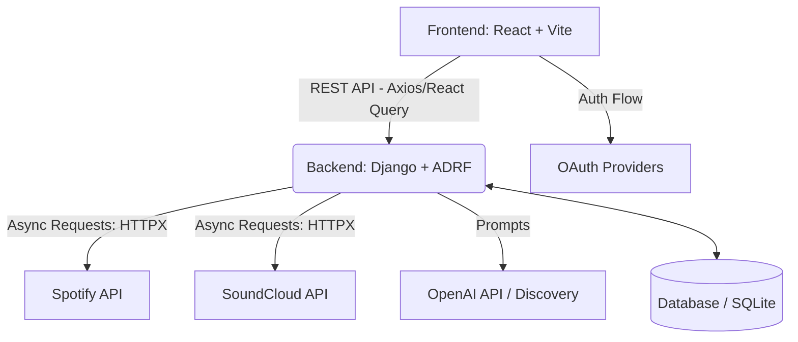

<div align="center">
  <h1>🎵 Music Hub</h1>
  <p><strong>A unified cross-platform music streaming and playlist management application ✨</strong></p>
  
  <p>
    
    
    
    
  </p>
</div>

<br />

## 🌟 About The Project

**Music Hub** is a comprehensive, modern web application designed to bridge the gap between different music streaming services. It enables users to seamlessly manage, combine, and discover music across platforms like **Spotify** and **SoundCloud** within a single, highly interactive interface. 

This project was built with a strong focus on modern web standards, utilizing **React 19** and **Vite** on the frontend, powered by an asynchronous **Django REST Framework** backend. 

### Why this project stands out?
- **Complex API Integrations:** Handles OAuth and seamless data synchronization with multiple external platforms.
- **AI Integration:** Implements an advanced "Discovery" module using **OpenAI** to generate smart song recommendations based on contextual user preferences.
- **Advanced State Management:** Uses **Redux Toolkit** and **React Query** for optimized caching, state handling, and performant asynchronous data fetching.
- **Asynchronous Python:** Leverages `adrf` (Async Django REST Framework) and `httpx` for high-performance, non-blocking I/O operations communicating with external APIs.
- **Advanced UI/UX:** Fluid queue and playlist management implemented using `@dnd-kit` for complex drag-and-drop interactions.

---

## 🚀 Key Features

- 🎧 **Cross-Platform Playlists:** Combine tracks from Spotify and SoundCloud into unified custom playlists.
- 🔀 **Queue Management:** Advanced drag-and-drop song queuing with real-time state synchronization.
- 🤖 **AI Discovery Module:** Receive context-aware and curated song recommendations from AI.
- 🔐 **Robust Authentication:** Secure authentication system using JWT, alongside OAuth integration for platform connections.
- 📻 **Music Playback:** Integrated cross-platform music playback capabilities directly in the browser.

---

## 🛠️ Technology Stack

### Frontend 💻
- **Framework:** React 19, Vite
- **State & Data Handling:** Redux Toolkit, TanStack React Query v5
- **Routing:** React Router v6
- **UI & Interactions:** Custom styling system, `dnd-kit` for drag-and-drop
- **HTTP Client:** Axios

### Backend ⚙️
- **Core:** Python, Django 5.2, Django REST Framework
- **Async Processing:** ADRF (Async DRF), HTTPX, AnyIO
- **AI & Integrations:** OpenAI API, Spotify API, SoundCloud API
- **Auth & Security:** SimpleJWT, OAuth extensions
- **Database:** SQLite (development)
- **API Documentation:** OpenAPI / Swagger (via `drf-spectacular`)

---

## 🏗️ Architecture & Data Flow



---

## 💻 Getting Started

Follow these steps to set up the project locally.

### Prerequisites
- [Node.js](https://nodejs.org/en/) (v18+)
- [Python](https://www.python.org/) (3.10+)

### 1. Backend Setup
```bash
# Navigate to the backend directory
cd backend/music_hub

# Create a virtual environment and activate it
python -m venv venv
source venv/bin/activate  # On Windows: venv\Scripts\activate

# Install dependencies
pip install -r requirements.txt

# Set up environment variables
# Note: Add your Spotify/SoundCloud/OpenAI API keys in the .env.
cp .env.example .env 

# Apply database migrations
python manage.py migrate

# Run the development server
python manage.py runserver
```

### 2. Frontend Setup
```bash
# Navigate to the frontend directory
cd frontend

# Install dependencies
npm install

# Start the development server
npm run dev
```

---
